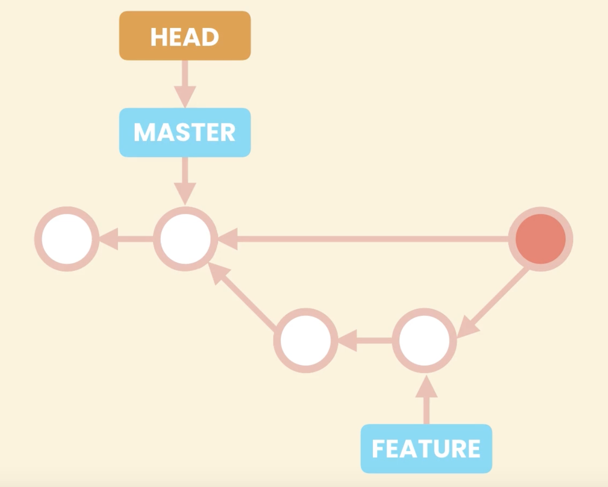
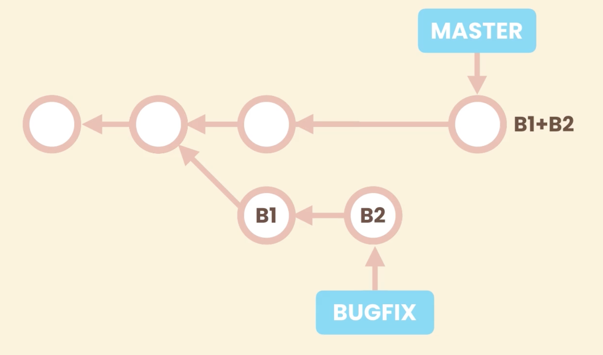
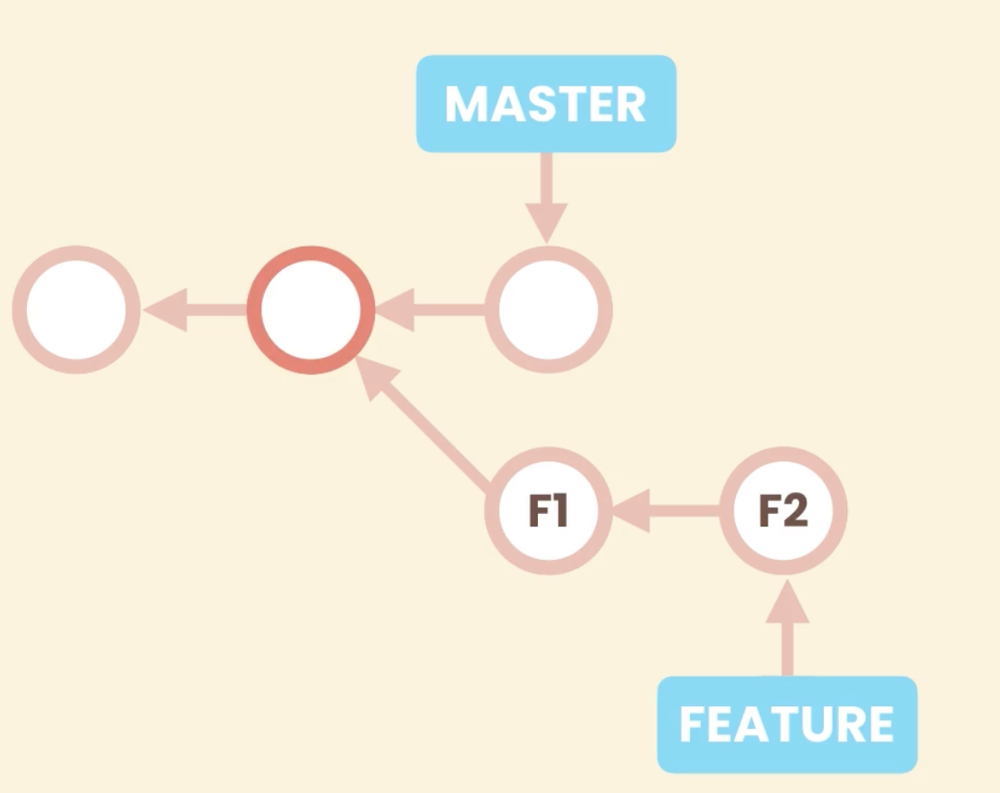
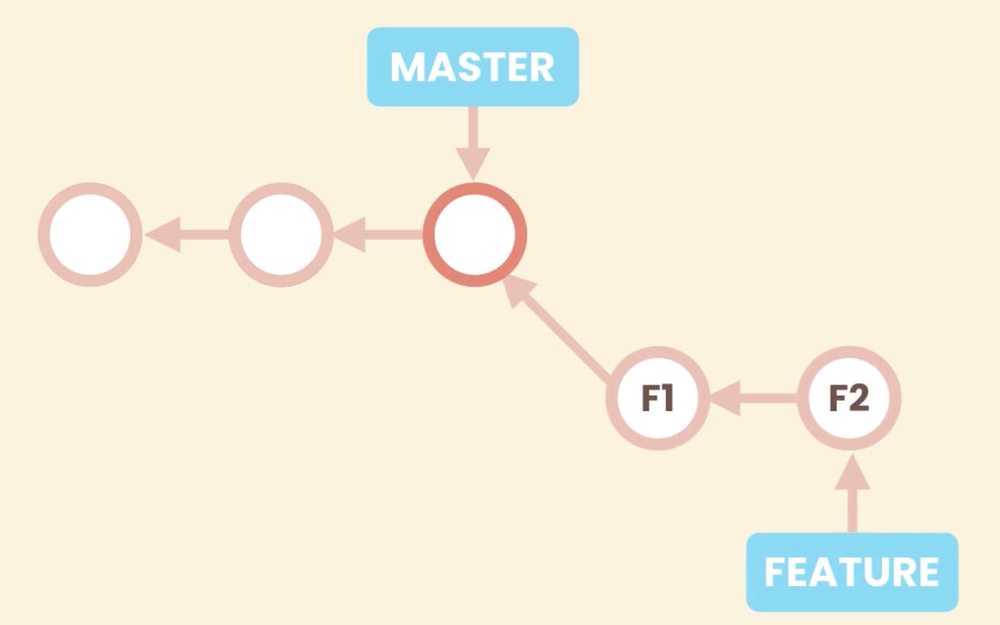
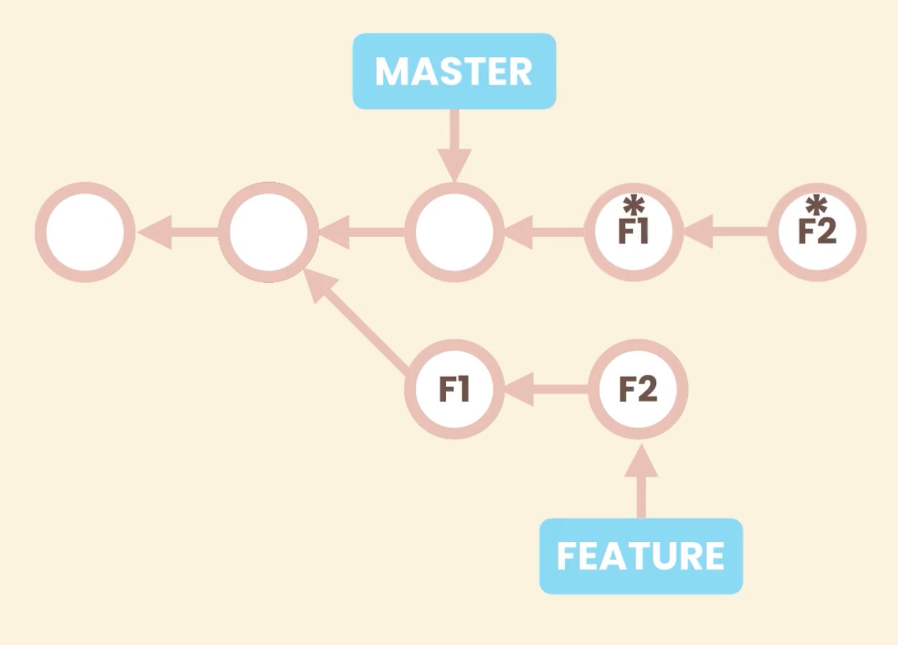
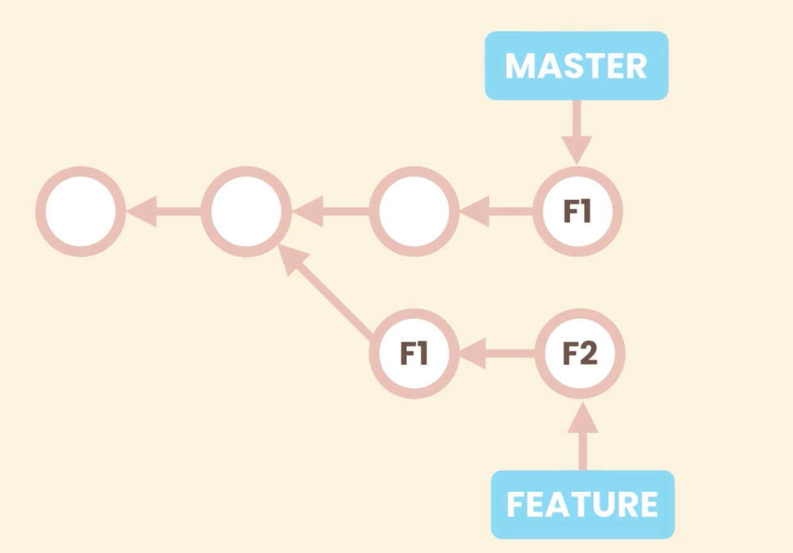

# Comprehensive Git Notes

## Basic

### Why Version Control System
- Track History
- Collaborate with others

### Types of Version Control System
- Centralized
- Distributed

### Setting
There are three setting levels in git:
1. **System**:
    - **Scope**: Applies to every user and all repositories on the machine.
    - **Location**: Stored in a system-wide configuration file (usually /etc/gitconfig on Linux/Mac, or in the Git installation directory on Windows).
    - **Usage**: Use this level to enforce policies or default behaviors for all users on a system.
    ```bash
    git config --system <key> <value>
    ```
2. **Global**:
    - **Scope**: Applies to the current user across all repositories on that machine.
    - **Location**: Stored in the user’s home directory, typically in ~/.gitconfig.
    - **Usage**: Ideal for user-specific configurations, such as name and email, which appear in commits.
    ```bash
    git config --global <key> <value>
    ```
3.  **Local**:
    - **Scope**: Specific to a single repository.
    - **Location**: Stored in the repository’s .git/config file.
    - **Usage**: Use local settings for repository-specific options like remote URLs, branch settings, or some custom behaviors that differ from your global preferences.
    ```bash
    git config --local <key> <value>
    ```

#### Common Settings
```bash
git config --global user.name "xyh" # Sets global commit author name.
git config --global user.email "abc@gmail.com" # Sets global commit author email.
git config --global core.editor "" # Defines global default text editor for Git.
git config --global core.autocrlf "" # windows - true, mac - input
# Configures Git’s automatic line ending conversion based on OS.
```
> Note: Global Core Autocrlf
> - On **Windows**: It’s common to set this to true so that Git converts **LF (Unix)** to **CRLF (Windows)** on checkout and vice versa on commit.
> - On **MacOS/Linux**: It’s typical to set this to input so that line endings **remain in Unix format** on commit while **converting CRLF to LF on input if necessary**.  


The file `config` can be open and updated:
```bash
git config --global -e # open global settings
```


#### Alias
```bash
# Set up custom command git lg 
git config --global alias.lg "log --pretty=format:'%an committed %h'"
```
```bash
# After set up
git lg
```
The example of command result is shown below:


## Creating Snapshots
### Staging area
The **staging area** in Git also known as the **index** is an intermediate space where you can **prepare and review changes** before finalizing them with a commit. 
There are some key features which is useful:
- **Selective commit**
- **Review changes**
- **Logical Grouping**: *create logical commit by staging relative changes.*

#### Add file into staging area
```bash
git add file1.js # add file into staging area
```

#### Commit
```bash
git commit -m 'first commit' 
# every commit git store fill content not diff
```

#### Add and commit Together
```bash
git commit -ma 'refactor code.' # add and commit simultaneously 
```
> **Noted**: This method is not recommended 

#### Remove file from Staging area
```bash
git rm --cached -r bin/ 
# -r stand for recursive (there multiple files under the path)
```  


## Browsing History
### `git log`
#### Basic
```bash
git log # show all the history of commit
git log --oneline # show all the history of commit in one line
git log --oneline --stat # also show files have been changed (diff numbers of lines -- number of insertions and deletions)
git log --oneline --patch # the diff details for each commit
```

#### Filtering the History
```bash
git log --oneline 3 # last 3 commit
git log --oneline -author="Mosh" # filter by author name
git log --oneline --before="2020-08-17" # filter commit before a specific date
git log --oneline --after="2020-08-17"
git log --oneline --after="yesterday"
git log --oneline --after="one week ago"
git log --oneline --grep="GUI" # this is case sensitive
git log --oneline -S"hello()" 
git log --oneline -S"Objective" --patch # lists commits that have introduced or removed the string "Objective" and displays the corresponding diff for each of those commits
git log --oneline fd0d184..edb3594 # show commits between two specific commit
git log --oneline toc.txt # show all commits that modified specific files
git log --oneline  -- toc.txt # file name is ambiguous (only required when git complain)
git log --oneline --patch -- toc.txt # git will recognize as file after two hyphens (--patch has to be before --) 
```
- The `--grep` option in git log lets you search commit messages for specific patterns.
- `-S"hello()"` is the “pickaxe” option. It will show commits that added or removed that specific string in the diff.


#### Formatting the log output
```bash
git log --pretty==format:"%an committed %h on %cd"
git log --pretty==format:"%Cgreen%an%Creset committed %h on %cd"
```
Example placeholders that expand to information extracted from the commit:
- `%H` commit hash
- `%h` abbreviated commit hash
- `%an` author name
- `%cd` committed date
- `Cgreen` set display color to green
- `Creset` reset display color back to white

Further information can be found in [git log documentation](https://git-scm.com/docs/git-log).


### View a Commit
```bash
git show HEAD~2 # the change of commit 2 steps before latest commit
git show HEAD~2: packages/react-reconciler/src/ReactFiberCommitWork.new.js # final version of this file stored in this commit
git show HEAD~2 --name-only # show files have been modified in this commit (only name, without status)
git show HEAD~2 --name-status # show modified files and their status in the commit
```

### Viewing the Changes Across Commits
```bash
git diff HEAD~2 HEAD 
git diff HEAD~2 HEAD  # find difference for specific file between two commit
git diff HEAD~2 HEAD --name-only
git diff HEAD~2 HEAD --name-status
```

### Checking Out a Commit
```bash
git checkout dad46ed # you are in 'detached HEAD' state, HEAD is pointing to the specific commit (refer figure below in Detached HEAD subsection)
git log --oneline # only commits before this commits are visible
git log --oneline --all # show all the commits
git checkout master # return back to the master branch, then can create new commit
```
#### HEAD pointing to Master


#### Detached HEAD

> Noted: do not create a new commit in this state


### Finding Bugs using Bisect
In order to find a bug, a good commit and a bad commit are required (divide the history into half).
```bash
git bisect start # start bisect
git bisect bad # current commit is a bad commit
git bisect good ca49180 # provide a good commit, and HEAD is detached to the middle between bad commit and good commit
git bisect good # if the current commit is good, and then HEAD move to the middle between current commit and bad commit
git bisect bad # if the current commit is bad, and then HEAD move to the middle between current commit and good commit, until the fist bad commit is found
git log --oneline --all # can be used to check where HEAD is pointing to
git bisect reset # return HEAD back to master, after finish
```

### Finding Contributors Using Shortlog
```bash
git shortlog
git shortlog -n -s -e
git shortlog -nse --before="2020-01-01" --after="2021-01-01"
```
- `-n` or `--numbered`: sort output according to the number of commits per author
- `-s` or `--summary`: Suppress commit descriptions, only provides commit count
- `-e` or `--email`: Show the email address of each author


### Viewing the History of a File
```bash
git log --oneline --stat --patch .gitignore # file name at the end
```


### Restoring a Deleted File
```bash
git rm toc.txt
git commit -m "Remove toc.txt"
git log --oneline toc.txt # ambiguous argument
git log --oneline -- toc.txt
git checkout a642e12 toc.txt # parent of the deleted commit, now the file is back to working directory and staging area (ready to commit)
git commit -m "Restore toc.txt"
```

### Blaming
```bash
 git blame .gitignore
 git blame -e .gitignore # show author email instead of name
 git blame -e -L 1,3 .gitignore # show the first three commit
```

### Tagging
```bash
git tag v1.0 # tag the current commit to v1.0
git tag v1.0 5e7a828 # tag the specific (previous) commit to v1.0
git checkout v1.0 # checkout using tag (instead of using commit id)
git tag # show all tags that are created
git tag -a v1.1 -m "My version 1.1" # annotated tag
git tag -n # show tag message
git show v1.1 # check the commit using tag

git tag -d  v1.1 # delete a tag
```
- For light weight tag, message is the commit message
- **Annotated Tag**:
    - An annotated tag is a full Git object that includes metadata (such as the tagger’s name, email, date, and a message) and can be signed. It’s typically used for marking releases, offering more context than a lightweight tag.


## Branching
### What are branching?
Git branching offers several key advantages:
- **Isolation of Work**: Git branches allow you to work on features, bug fixes, or experiments in isolation without affecting the main codebase.
- **Lightweight Pointers**: Branches are simply pointers to commits, making them inexpensive to create and switch between.
- **Parallel Development**: Multiple branches enable different team members to work simultaneously without interfering with each other.
- **Merging**: Once the work on a branch is complete, you can merge it back into the main branch, integrating your changes.
- **Workflow Flexibility**: Branches support various workflows (like feature branching, GitFlow, etc.) that streamline development and code review processes.


### Working with Branches
```bash
git branch bugfix # create a new branch
git branch        # list of branches
git status        # can check the current branch as well

git switch bugfix # switch branch to bugfix

git switch -C bugfix/login-form # create and switch to new created branch

git branch -m bugfix bugfix/signup-form # rename branch: {old name} {new name}

git branch -d bugfix/signup-form # delete the branch
git branch -D bugfix/signup-form # Force to delete the branch without merging
```
> Noted: Potential Error if the branch is not fully merged during deleting


### Comparing Branches
```bash
git log master..bugfix/signup-form # show all commits that are in bugfix but not in master

# See actual changes
git diff master..bugfix/signup-form
# If HEAD -> Master
git diff bugfix/signup-form
git diff --name-only bugfix/signup-form
git diff --status bugfix/signup-form
```


### Stashing
**Definition**:
Git stashing is a feature that temporarily saves your uncommitted changes—both staged and unstaged so you can work on something else and later reapply those changes.
- **Temporary Storage**: It acts as a temporary storage area for modifications that you’re not yet ready to commit.
- **Clean Working Directory**: Stashing reverts your working directory to a clean state, allowing you to switch contexts or branches without losing your work.
- **Stack-Like Behavior**: Stashed changes are stored in a stack-like structure, enabling you to save multiple stashes and retrieve them later.
- **Easy Retrieval**:
You can apply or pop stashed changes back into your working directory when you’re ready to resume your work.
- **Use Cases**: Ideal for quickly switching branches, working on urgent fixes, or pausing incomplete work without committing changes.
```bash
# create a new stash
git stash push -m "New tax rules"
# Saved working directory and index state On master called: New tax rules.

git stash push -am "My new stash." # create new file after stash

git stash list # list all the stashes we have

git stash show stash@{1} # show diff between working directory and stash
git stash show 1

git stash apply 1 # take stash back to working directory

git stash drop 1 # remove the specific stash

git stash clear # remove all the stash
```


### Merging
There are types of merging:
- Fast-forward merges: without diverge
- 3-way merges: two branches diverge

#### Fast-forward merges

Then simply just bring the master forward.

Then we can remove the bugfix pointer.
```bash
# check the branch as first step
git log --oneline --all --graph

git merge bugfix/signup-form # make sure on the master branch

git merge -ff bugfix/signup-form

```

#### 3-Way Merge


```bash
git merge --no-ff bugfix/login-form # commit merge

git config ff no # disable fast forward only in this repository
git config --global ff no # disable fast forward globally

git merge feature/change-password 
```

### Viewing the Merged Branches
 ```bash
 # list of branches that already merged into master (which means they are safe to be deleted)
git branch --merged 

# list of branches that have not merged into master
git branch --no-merged
 ```


 ### Merge Conflicts
 ```bash
 git merge bugfix/change_password
 # CONFLICT (content): merge conflict in {file name}
 # Automatic merge failed; fix conflicts and then commit the result
 ```

 #### Visual Merge Tools
 - vscode
 - [p4merge](https://www.perforce.com/products/helix-core-apps/merge-diff-tool-p4merge)
 ```bash
 # set up merge tool
 git config --global merge.tool {merge tool}

# for p4merge macos
git config --global mergetool.p4merge.path "/Applications/p4merge.app/Content/MacOS/p4merge"

# merge using merge tool
git mergetool

# commit after solving all the conflicts
 ```


 ### Aborting a Merge
 ```bash
 # back to status before merge
git merge --abort 
 ```


 ### Undoing a Faulty Merge
 
 Move master back to last commit and git will consider the merge commit as garbage commit and automatically remove it from repository
 ```bash
 git reset --hard HEAD~1
 ```
 There are 3 types of resetting: 
 - `--soft`: working directory and staging area are not affected, only last snapshot
 - `--mixed`: (default option) affect staging area and last snapshot (local changes in working directory will not change)
 - `--hard`: take snapshot and putting into working directory
```bash
# undo the deletion of merge commit
git reset --hard f634b2a
```
> Note: Only when commit history is not shared to others

#### Reverting Commit
The better way to undo is using **revert**.
```bash
git revert -m 1 HEAD # first parent
```


### Squash Merge
 
Then we can delete the bugfix branch. This is suitable for the small changes.
```bash
# Under branch e.g. bugfix/photo-upload 
git merge --squash bugfix/photo-upload
git commit -m "fix: photo upload page"

# this branch won't show in
git branch --merge # squash merged branch won't show
git branch --no-merged # will show
git branch -D fix/photo_upload # force delete only (git consider it as unmerged branch)
```
> For squash merge, it is important to remove the target branch. Otherwise, it might produce confusion in the future as it will still be shown in no merged command.


### Rebasing 
As the merges become more and more, it might be confusing. It will be good to make our commit chain linear.
 
 
Then we can do the fast forward merge.
> Note: We need to be cautious of rebasing, as rebasing rewrites history. We should only use rebasing only for branches were commits of our local in the repository.

The reason will be shown below:
 
Because git can not change the root of F1 & F2 (immutable), so git will create another two new commits on top of current master. And then it will move pointer of features to $\overset{*}{F_2}$. If you have share F1 or F2 with others,  and other people create new commit on top of F2. After rebasing, their history is going to get screwed.

As the time goes, git is going to remove F1 and F2 automatically.

There are two possible consequence for rebasing:
- no merge conflict
```bash
git switch -C 'feature/shopping-cart'
git commit -m "add ..."
git switch master
git commit -m "change ..."
git switch feature/shopping-cart # have to switch to target branch
git rebase master
git switch master
git merge --ff feature/shopping-cart # fast forward merge 
```

- merge conflict
```bash
git rebase master
# Auto-merging toc.txt
# CONFLICT (content): Merge conflict in toc.txt
# error: could not apply 97e93a6... Update toc.txt 1
# Resolve all conflicts manually, mark them as resolved with
# "git add/rm <conflicted_files>", then run "git rebase --continue".
# You can instead skip this commit: run "git rebase --skip".
# To abort and get back to the state before "git rebase", run "git rebase --abort".
# Could not apply 97e93a6... Update toc.txt 1
git mergetool
# once the conflict is solved
git rebase --continue # it will check conflict, complain if there is still a conflict
git rebase --skip # if the conflict can be ignored -skip
git rebase --abort # back state before rebasing
```

After rebasing, you will find a file called e.g. `toc.txt.orig`. This is the original file before rebasing from master created by p4merge.
```bash
git clean -fd # means force delete unstaged files (including directories like folder)

# rm command can be used as well
```

To prevent automatic generate the back up files:
```bash
git config --global mergetool.keepBackup false
```


### Cherry Picking
If the F1 has some new tiny feature that master want to have, but we are not ready to merge yet. Cherry Picking can help us pick F1 on top of master shown in the figure below.
 
```bash
git cherry-pick 5670ecc
# Auto-merging toc.txt
# CONFLICT (content): Merge conflict in toc.txt
# error: could not apply a1f63e6... Update toc.txt 1
# hint: after resolving the conflicts, mark the corrected paths
# hint: with 'git add <paths>' or 'git rm <paths>'
# hint: and commit the result with 'git commit'

# use merge tool to fix the merge
git mergetool
git add .
git commit -m "message"
```

### Picking Files from Another Branch
```bash
git switch -C feature/send-mail
git add .
git commit
git switch master
git restore --source=feature/send-mail -- mail.txt # the files will be added into working directories
git add .
git commit
```


## Collaboration


### remote tacking branch
```bash
git remote
git remote -v
```

### Fetching
```bash
git fetch origin # download all commit
git branch -vv # difference between current branch and remote branch 
git merge origin/master
```


### Pulling
$$pull = fetch + merge$$
```bash
git pull # if branch diverse three way merge
git pull --rebase # avoid three way merge --rebase
```

### Pushing
```bash
git push origin master # default will be git push
```


### Sharing tags
```bash
git tag v1.0
git push origin v1.0
git push origin --delete v1.0
git tag -d v1.0
```


### Sharing Branches
```bash
git branch -vv
git branch -r # check current remote tracking branch
git push -u origin feature/password # push branch to remote repository
git branch -r

# delete remote branch 
git push -d origin feature/password

# delete local branch
git switch master
git branch -d feature/password
```
`-u` short for `--set-upstream`


### Collaboration Workflow
```bash
git switch -C feature/change-password origin/feature/change-password
git remote prune origin # remove tracking branches that are not under remote 
```


### Keeping a Forked Repository Up to Date
```bash
git remote # check current repository
# shows the URLs that Git uses to fetch from and push to the remotes
git remote -v  

# add a new remote
git remote add upstream {BASE_URL}
git remote
git remote -v

# rename
git remote rename upstream base
# remove
git remote rm base

# fetch from upstream
git fetch upstream

# the local master is behind the upstream master, so merge is required
git switch master
git merge base/master
# then push to origin
git push
```
> It is good to merge master to bugfix branch, to avoid future conflicts


## Rewriting History

### The Golden Rule of Rewriting History
**Don't rewrite public history!**


### Undoing Commit
```bash
git reset --hard HEAD~1

# differences between the staged changes and the last commit (HEAD)
git diff --cached
```


### Reverting Commits
If already pushed commit to remote.
```bash
git revert HEAD~2
git revert HEAD~3..HEAD # revert (3, 0] commit
# revert last 3 commit, do not include HEAD~3

git revert --no-commit HEAD~3.. # HEAD can be dropped
# abort
git revert --abort

# continue
git revert --continue
```

### Recovering Lost Commits
```bash
# shows a log of where HEAD and branch references
git reflog
git reset --hard HEAD@{1}

# show history of feature pointer
git reflog show feature
```


### Amending the Last Commit
```bash
git add .
git commit --amend -m "message"
```


### Amending an Earlier Commit
```bash
git rebase -i {HASH} # interactive
git rebase --abort

# do your change
git add .
git commit --amend -m "message"

git rebase --continue
```


### Dropping Commits
```bash
git rebase -i 6cbd931~ # ^ means parent
# drop commit

git mergetool

git rebase --continue
```


### Rewording Commit Messages
```bash
git rebase -i f283d7524^
```

### Re-ordering Commits
```bash
git rebase -i f283d7524^
```


### Squashing Commits
```bash
git rebase -i f283d7524
# squash
# you do have chance to re-type previous commit 

git rebase -i f283d7524
# fixup (ignore the commit and join it into previous one)
# you do not have chance to re-type previous commit 
```


### Splitting a Commit
```bash
git rebase -i f283d7524
# edit

git reset --mixed HEAD^ # HEAD^ == HEAD~1
# to change and commit it
# to change and commit it
git rebase --continue
```