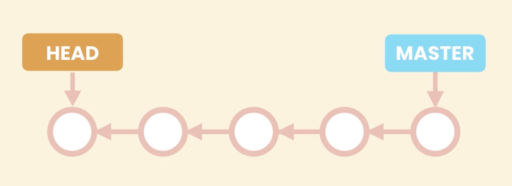

## Basic

### Why Version Control System
- Track History
- Collaborate with others

### Types of Version Control System
- Centralized
- Distributed

### Setting
There are three setting levels in git:
1. **System**:
    - **Scope**: Applies to every user and all repositories on the machine.
    - **Location**: Stored in a system-wide configuration file (usually /etc/gitconfig on Linux/Mac, or in the Git installation directory on Windows).
    - **Usage**: Use this level to enforce policies or default behaviors for all users on a system.
    ```bash
    git config --system <key> <value>
    ```
2. **Global**:
    - **Scope**: Applies to the current user across all repositories on that machine.
    - **Location**: Stored in the user’s home directory, typically in ~/.gitconfig.
    - **Usage**: Ideal for user-specific configurations, such as name and email, which appear in commits.
    ```bash
    git config --global <key> <value>
    ```
3.  **Local**:
    - **Scope**: Specific to a single repository.
    - **Location**: Stored in the repository’s .git/config file.
    - **Usage**: Use local settings for repository-specific options like remote URLs, branch settings, or some custom behaviors that differ from your global preferences.
    ```bash
    git config --local <key> <value>
    ```

#### Common Settings
```bash
git config --global user.name "xyh" # Sets global commit author name.
git config --global user.email "abc@gmail.com" # Sets global commit author email.
git config --global core.editor "" # Defines global default text editor for Git.
git config --global core.autocrlf "" # windows - true, mac - input
# Configures Git’s automatic line ending conversion based on OS.
```
> Note: Global Core Autocrlf
> - On **Windows**: It’s common to set this to true so that Git converts **LF (Unix)** to **CRLF (Windows)** on checkout and vice versa on commit.
> - On **MacOS/Linux**: It’s typical to set this to input so that line endings **remain in Unix format** on commit while **converting CRLF to LF on input if necessary**.  


The file `config` can be open and updated:
```bash
git config --global -e # open global settings
```


#### Alias
```bash
# Set up custom command git lg 
git config --global alias.lg "log --pretty=format:'%an committed %h'"
```
```bash
# After set up
git lg
```
The example of command result is shown below:


## Creating Snapshots
### Staging area
The **staging area** in Git also known as the **index** is an intermediate space where you can **prepare and review changes** before finalizing them with a commit. 
There are some key features which is useful:
- **Selective commit**
- **Review changes**
- **Logical Grouping**: *create logical commit by staging relative changes.*

#### Add file into staging area
```bash
git add file1.js # add file into staging area
```

#### Commit
```bash
git commit -m 'first commit' 
# every commit git store fill content not diff
```

#### Add and commit Together
```bash
git commit -ma 'refactor code.' # add and commit simultaneously 
```
> **Noted**: This method is not recommended 

#### Remove file from Staging area
```bash
git rm --cached -r bin/ 
# -r stand for recursive (there multiple files under the path)
```  


## Browsing History
### `git log`
#### Basic
```bash
git log # show all the history of commit
git log --oneline # show all the history of commit in one line
git log --oneline --stat # also show files have been changed (diff numbers of lines -- number of insertions and deletions)
git log --oneline --patch # the diff details for each commit
```

#### Filtering the History
```bash
git log --oneline 3 # last 3 commit
git log --oneline -author="Mosh" # filter by author name
git log --oneline --before="2020-08-17" # filter commit before a specific date
git log --oneline --after="2020-08-17"
git log --oneline --after="yesterday"
git log --oneline --after="one week ago"
git log --oneline --grep="GUI" # this is case sensitive
git log --oneline -S"hello()" 
git log --oneline -S"Objective" --patch # lists commits that have introduced or removed the string "Objective" and displays the corresponding diff for each of those commits
git log --oneline fd0d184..edb3594 # show commits between two specific commit
git log --oneline toc.txt # show all commits that modified specific files
git log --oneline  -- toc.txt # file name is ambiguous (only required when git complain)
git log --oneline --patch -- toc.txt # git will recognize as file after two hyphens (--patch has to be before --) 
```
- The `--grep` option in git log lets you search commit messages for specific patterns.
- `-S"hello()"` is the “pickaxe” option. It will show commits that added or removed that specific string in the diff.


#### Formatting the log output
```bash
git log --pretty==format:"%an committed %h on %cd"
git log --pretty==format:"%Cgreen%an%Creset committed %h on %cd"
```
Example placeholders that expand to information extracted from the commit:
- `%H` commit hash
- `%h` abbreviated commit hash
- `%an` author name
- `%cd` committed date
- `Cgreen` set display color to green
- `Creset` reset display color back to white

Further information can be found in [git log documentation](https://git-scm.com/docs/git-log).


#### View a Commit
```bash
git show HEAD~2 # the change of commit 2 steps before latest commit
git show HEAD~2: packages/react-reconciler/src/ReactFiberCommitWork.new.js # final version of this file stored in this commit
git show HEAD~2 --name-only # show files have been modified in this commit (only name, without status)
git show HEAD~2 --name-status # show modified files and their status in the commit
```

#### Viewing the Changes Across Commits
```bash
git diff HEAD~2 HEAD 
git diff HEAD~2 HEAD  # find difference for specific file between two commit
git diff HEAD~2 HEAD --name-only
git diff HEAD~2 HEAD --name-status
```

#### Checking Out a Commit
```bash
git checkout dad46ed # you are in 'detached HEAD' state, HEAD is pointing to the specific commit (refer figure below in Detached HEAD subsection)
git log --oneline # only commits before this commits are visible
git log --oneline --all # show all the commits
git checkout master # return back to the master branch, then can create new commit
```
##### HEAD pointing to Master


##### Detached HEAD

> Noted: do not create a new commit in this state

